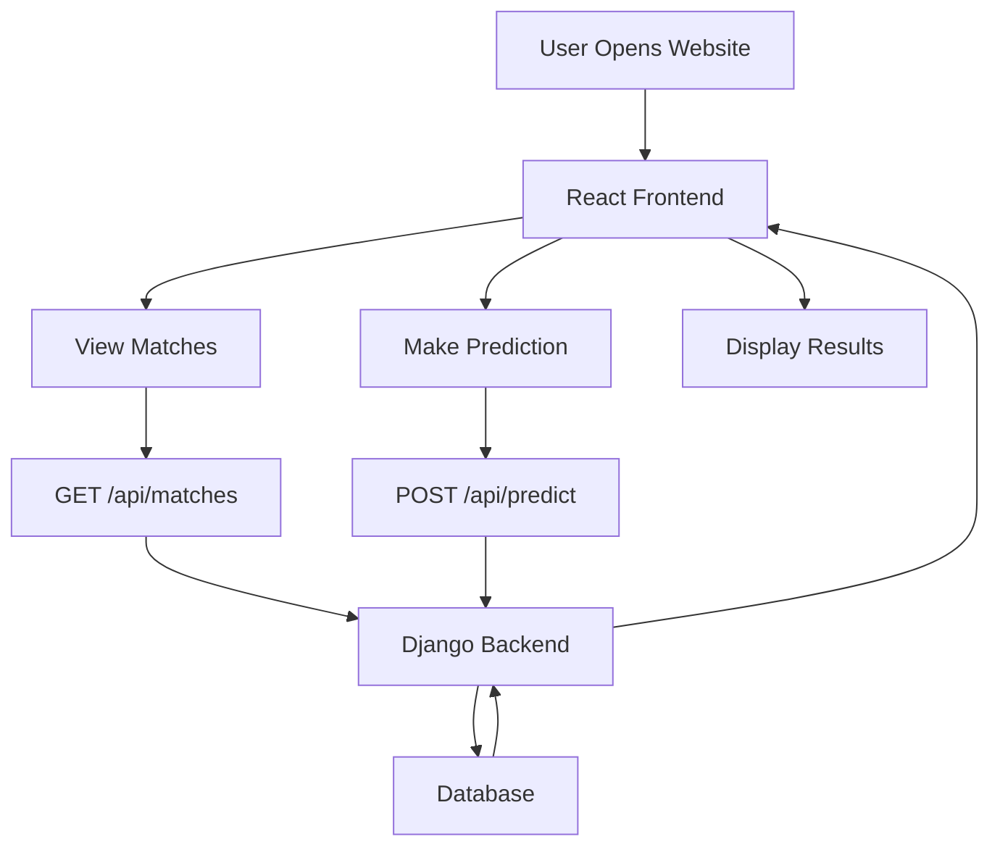
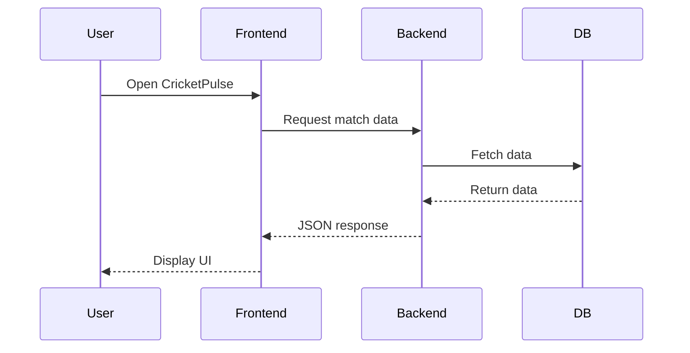

# CricketPulse
[badges here]

[](https://vruthvik-chinthoju.github.io/cricketpulse-frontend/)
[](https://cricketpulse-backend.onrender.com/)

**CricketPulse is an AI-powered cricket analytics platform that delivers intelligent match predictions, real-time insights, and an interactive user experience.**


---

## Live Demo

**Frontend**  
https://vruthvik-chinthoju.github.io/cricketpulse-frontend/

**Backend API**  
https://cricketpulse-backend.onrender.com/

---

## 🚀 Overview

CricketPulse is a full-stack web application designed to enhance the cricket experience using **data-driven insights and AI-powered predictions**. It provides live match data, player statistics, and predictive analytics to help users make informed decisions.

---

## ✨ Features

* 📊 **Live Match Insights** – Real-time match data and updates
* 🤖 **AI Match Prediction** – Predict match outcomes using intelligent algorithms
* 🧠 **AI Chatbot Assistant** – Ask cricket-related queries
* 🔐 **Authentication System** – Secure login with Google & GitHub
* 🏆 **Leaderboard System** – Track user predictions and rankings
* 📈 **Player & Team Stats** – Detailed analytics and performance insights
* ⚡ **Server Wake Detection UI** – Handles backend sleep/wake states smoothly

---
## 📚 Table of Contents

- [Live Demo](#-live-demo)
- [Features](#-features)
- [Tech Stack](#-tech-stack)
- [AI Prediction System](#-ai-prediction-system)
- [API Endpoints](#-api-endpoints)
- [Project Structure](#-project-structure)
- [System Architecture](#-system-architecture)
- [API Communication Flow](#-api-communication-flow)
- [Deployment Architecture](#-deployment-architecture)
- [Installation](#-installation)
- [Backend Setup](#-backend-setup)
- [Frontend Setup](#-frontend-setup)
- [Screenshots](#-screenshots)
- [Future Improvements](#-future-improvements)
- [Author](#-author)
---

## 🛠️ Tech Stack

### 🌐 Frontend

* React.js (Vite)
* CSS / Custom Styling
* Axios

### ⚙️ Backend

* Django
* Django REST Framework
* PostgreSQL (Neon DB)

### ☁️ Deployment

* Frontend: GitHub Pages
* Backend: Render
* Database: Neon PostgreSQL

---

## 📁 Project Structure

```
cricketpulse/
│── frontend/        # React frontend
│   ├── src/
│   ├── public/
│   ├── package.json
│
│── backend/         # Django backend
│   ├── core/
│   ├── cricketpulse/
│   ├── manage.py
│   ├── requirements.txt
│
│── .gitignore
│── README.md
```

---

## ⚙️ Installation & Setup

### 🔽 Clone Repository

```bash
git clone https://github.com/vruthvik-chinthoju/cricketpulse.git
cd cricketpulse
```

---

### 🧩 Backend Setup

```bash
cd backend
pip install -r requirements.txt
python manage.py migrate
python manage.py runserver
```

Backend runs at:

```
http://127.0.0.1:8000/
```

---

### 🎨 Frontend Setup

```bash
cd frontend
npm install
npm run dev
```

Frontend runs at:

```
http://localhost:5173/
```

---

## 🔗 API Integration

Make sure your frontend API base URL points to backend:

```js
http://127.0.0.1:8000/api/
```

For production:

```js
https://your-backend-url.onrender.com/api/
```

---
## 🔗 API Endpoints

## Matches

| Method | Endpoint | Description |
|------|------|------|
| GET | `/api/matches/` | Get all matches |
| GET | `/api/matches/{id}/` | Get match details |

## Predictions

| Method | Endpoint | Description |
|------|------|------|
| POST | `/api/predict/` | Predict match outcome |
| GET | `/api/predictions/` | User predictions |

## Authentication

| Method | Endpoint | Description |
|------|------|------|
| POST | `/api/login/` | Login |
| POST | `/api/register/` | Register |
| POST | `/api/github-login/` | GitHub OAuth |
---

## 🤖 AI Prediction System

The AI engine analyzes:

* Team performance
* Player statistics
* Historical match data

It then predicts:

* Match winner
* Probability insights

---
## 🔁 Application Flow


---

---
## 🔄 API Communication Flow


---
## 📸 Screenshots

*(Add screenshots here later for better presentation)*

---

## 🌐 Deployment Guide

### Backend (Render)

* Connect GitHub repo
* Add environment variables
* Set start command:

```bash
gunicorn cricketpulse.wsgi:application
```

---

### Frontend (Vercel)

* Import GitHub repo
* Set build command:

```bash
npm run build
```

---

## ⚠️ Important Notes

* Do NOT upload `node_modules`
* Use `.env` for secrets
* Backend may sleep on free hosting (handled in UI)

---

## 🤝 Contributing

Contributions are welcome!
Feel free to fork the repo and submit a pull request.

---
## 🔮 Future Enhancements

- 📊 **Advanced Data Visualization**
  - Add Pie Charts, Bar Graphs, and Line Charts  
  - Visualize player stats, team performance, and match trends  

- 🤖 **AI/ML Prediction Model**
  - Train models on historical IPL datasets  
  - Improve accuracy using player form, team combinations, and venue stats  
  - Explore models like Random Forest and Neural Networks  

- 📈 **Real-Time Analytics**
  - Live win probability graphs  
  - Dynamic score projections and run-rate tracking  

- 🧠 **Enhanced AI Chatbot**
  - Context-aware cricket insights  
  - Player comparisons and match analysis  

- 🏆 **Gamified Prediction System**
  - Points, badges, and global leaderboard  
  - User prediction history  

- 📱 **Mobile & Performance Optimization**
  - Fully responsive UI  
  - Faster APIs with caching and lazy loading  

- 🌐 **Multi-League Support**
  - Extend beyond IPL (BBL, PSL, international matches)  

- 🔐 **Security & Personalization**
  - JWT authentication  
  - Personalized dashboards and user stats  
---

## 👨‍💻 Author

**Ruthvik Chintu**

* GitHub: https://github.com/vruthvik-chinthoju

---

## ⭐ Support

If you like this project:

* ⭐ Star the repo
* 🍴 Fork it
* 🧑‍💻 Contribute

---

## 📄 License

This project is licensed under the MIT License.
